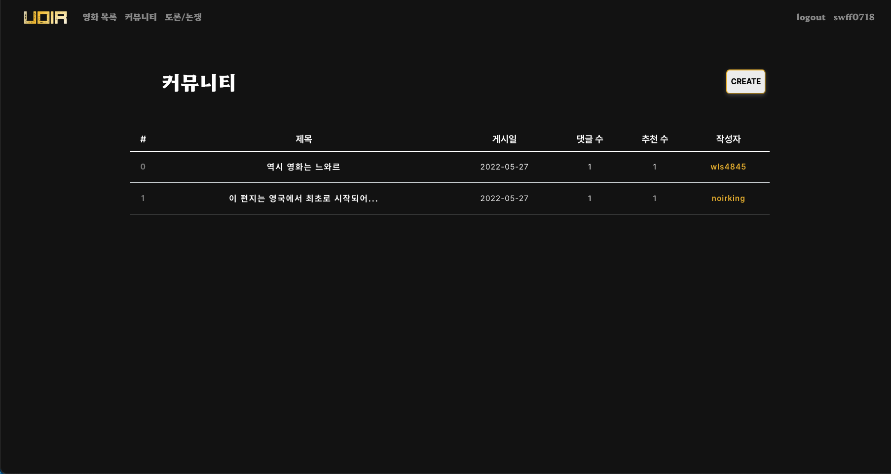

# UOIR

## 팀원 소개 및 업무 분담 내역

### 장지선

- 프로젝트 기획 및 디자인
- 데이터 수집
- 추천 알고리즘 구현
- 백엔드 개발
- 프론트엔드 개발

### 홍성목

- 데이터베이스 모델링
- 데이터 수집
- 백엔드 개발
- 프론트엔드 개발


### 프로젝트를 통해 느낀점

### 장지선

- 기초적인 명세 외에 기획부터 개발까지 구성하려 하니 시작부터 막막함이 있었다. 하고 싶은 건 많은데, 시간 내에 할 수 있는지 없는지도 고려해야 했고, 과연 우리가 어디까지 구현할 수 있는지, 이게 왜 / 정말 필요한 것인지 생각해보며 서툴지만 팀원과 회의를 거치며 하나하나 만들어나가는 게 재밌었다.
- 웹 사이트를 본격적으로 만들어보니 그간 다른 웹 사이트를 이용할 때 생각 없이 편하게 사용하던 것들, 혹은 뭔가 불편했지만 뭔지 몰랐던 것들이 조금이나마 실체적으로 느껴지게 되었다. 막연히 '잘할 수 있다!'라고 생각하고 도전했는데, 그만큼 뿌듯함은 크지만 앞으로 배워야 할 게 훨씬 더 많은 사람이라는 걸 느꼈다.
- 특히 프론트 부분에서 많은 시간을 투자하고도 원하던 구현을 제대로 하지 못해 아쉬움이 컸다. 데이터를 수집해놓고 반영하지 못한 부분도 있었다. 첫 프로젝트니만큼 실수가 있었던 것 같고, 이를 계기로 다음 프로젝트부터는 같은 실수를 반복하지 말아야겠다고 생각했다.
- 같이 했던 성목님 정말 즐겁고 재밌었습니다!

### 홍성목

- 최종 프로젝트에서는 Django REST API를 통하여 백엔드를 구성하고, Vue.js를 통해 프론트를 구현하였는데, 이렇게 프론트, 백을 나누어서 구현한 적이 처음이라 막막하기도 하고 프로젝트 초반에는 적응하는데 어려움이 있었다.
  그래서 조원과 프론트, 백을 나누어서 구현할까 하다가, 같이 백엔드를 먼저 구현하고 하자고 얘기가 되어서 데이터베이스 설계 및 수집, 백엔드 구현을 완료한 후에 프론트 작업을 시작하였다.
  다른 조에 비하여 프론트 작업을 늦은 시점에 시작하였지만, 백엔드를 다 구현해놓고 해서 완벽하진 않지만 시간 안에 원하는 기능을 구현할 수 있었다.


## 프로젝트 개요

### 프로젝트 컨셉

**Uoir (You + noir)**

- 추천 알고리즘을 적용한 영화 커뮤니티 사이트
  - 한국 범죄 / 느와르 영화 정보 및 추천 커뮤니티 사이트


### 개발환경


## 프로젝트 설치

### Back

**final-back 폴더로 이동**

```
cd final-back
```

**가상환경 생성**

```
python -m venv venv
```

**가상환경 실행**

```
# Windows
source venv/scripts/activate

# Mac
source venv/bin/activate
```

**패키지 설치**

```
pip install -r requirements.txt
```

**서버 실행**

```
python manage.py runserver
```


### front

**final-front 폴더로 이동**

```
cd final-front
```

**프로젝트 설치**

```
npm install
```

**서버 실행**

```
npm run serve
```


## 목표 서비스 구현 및 실제 구현 정도

- 영화 전체 목록 보기에서 관객 수, 좋아요, 평점 기준 정렬
- 영화 상세페이지에서 유튜브 트레일러 제공, 넷플릭스, 왓챠 링크 제공
- 추천 알고리즘을 통한 영화 추천
- 영화 좋아요 기능
- 커뮤니티 기능 + 댓글, 좋아요 구현
- 토론 / 논쟁 서비스

- ~~검색 기능~~

  -> 시간 관계상 구현 못함.

## 데이터 베이스 모델링 (ERD)


## 프로젝트 소개

### 홈페이지 기능

- 메인 페이지에서 3D Carousel을 통한 관객수 기준 상위 영화 표시
  - 마우스 오버시 회전 멈춤 및 드래그 시 회전 기능
  - 영화 포스터 클릭 시 해당 영화 상세 페이지로 이동
- 영화 목록 페이지에서 포스터, 영화 제목 및 개봉일 표시
  - 정렬 버튼 클릭시 관객수, 평점, 좋아요 기준으로 내림차순 정렬
  - 포스터 클릭 시 해당 영화 상세페이지로 이동

- 영화 상세페이지
  - 예고편 영상 및 넷플릭스, 왓챠에 해당 영화가 있을 시 버튼 표시
  - 좋아요 기능 구현
  - 배우 및 제작진, 상세 줄거리 확인 가능
  - 리뷰 작성 기능

- 커뮤니티 페이지
  - 게시글 작성 기능
  - 게시글 상세페이지에서 해당 게시글의 작성자일때만 수정,삭제 버튼 표시
  - 좋아요 기능 구현
  - 댓글 기능 구현

- 토론 논쟁 페이지
  - 토론/논쟁 페이지
  - 투표 클릭 시 실시간 반영 확인 가능
- 마이 페이지
  - 좋아요 한 영화, 작성 리뷰, 작성 게시글의 개수 한번에 확인 가능
  - 좋아요한 영화 표시
    - 클릭 시 상세 페이지로 이동
  - 추천 알고리즘을 통한 영화 추천
    - 클릭 시 상세 페이지로 이동
  - 내가 작성한 게시글 확인 기능
  - 내가 작성한 리뷰 확인 기능


### 데이터 베이스 수집

- TMDB API 활용하여 한국 범죄 영화 정보 가져옴
- 이후, 서비스 구현에 필요한 추가적인 정보 가져오기
  - 관객수, 상영시간 : 웹 크롤링 통하여 구현
  - 예고 영상, 넷플릭스 및 왓챠 링크 : 검색을 통하여 직접 기입.


### 추천 알고리즘


### 메인 페이지


### 영화 목록 페이지


### 영화 상세 페이지


### 커뮤니티 페이지



### 게시글 생성


### 토론/논쟁 페이지


**상세 페이지**


### 프로필 페이지


